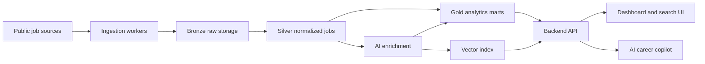

# System Architecture

The platform is organized as a pipeline-first data product with a backend API and AI layer on top.

## High-Level Flow

## Components

### Data Sources

Potential sources:

- Company career pages
- Greenhouse job boards
- Lever job boards
- Public job APIs
- Public salary datasets
- Manually seeded sample datasets for development

LinkedIn data should be handled carefully because scraping may violate terms of service. For a portfolio project, company ATS pages and public APIs are safer starting points.

### Ingestion

Python ingestion workers collect postings from source-specific connectors.

Responsibilities:

- Fetch new and changed postings
- Respect source rate limits
- Normalize raw source metadata
- Store raw payloads for reproducibility
- Retry transient failures
- Track source freshness and ingestion status

### Storage Layers

- **Bronze:** raw source payloads, stored as JSON or Parquet.
- **Silver:** cleaned canonical job postings with consistent company, title, location, salary, and description fields.
- **Gold:** analytics-ready tables for dashboards, trends, and API queries.

### Transformations

Transformations convert raw postings into trusted models.

Responsibilities:

- Deduplicate jobs across sources
- Normalize job titles, companies, locations, salaries, and remote status
- Extract and map skills
- Assign seniority
- Build fact and dimension tables
- Create aggregates for dashboard performance

### Backend API

FastAPI exposes product-facing services:

- Job search
- Trend analytics
- Company profiles
- Skill analytics
- Resume upload and parsing
- Resume-to-job matching
- AI assistant endpoints

### AI Layer

The AI layer enriches postings and powers user-facing intelligence.

Capabilities:

- Skill extraction
- Seniority classification
- Salary normalization assistance
- Embedding generation
- Semantic search
- Resume matching
- RAG responses over job data

### Frontend

The frontend can start as Streamlit for the MVP and later move to Next.js for a more polished product.

Core screens:

- Market dashboard
- Job search
- Job detail page
- Resume match report
- AI career copilot

### Infrastructure

Recommended baseline:

- Docker Compose for local development
- Postgres for relational storage
- Local files or S3-compatible storage for raw payloads
- GitHub Actions for linting, tests, and build checks
- Airflow or a lightweight scheduler for ingestion jobs

## Design Decisions

- Keep raw payloads so extraction and modeling can be re-run.
- Separate canonical job records from analytics marts.
- Make source freshness and data quality visible.
- Use deterministic extraction where possible and LLM extraction where it adds clear value.
- Design AI answers to cite retrieved postings or aggregated trend records.
