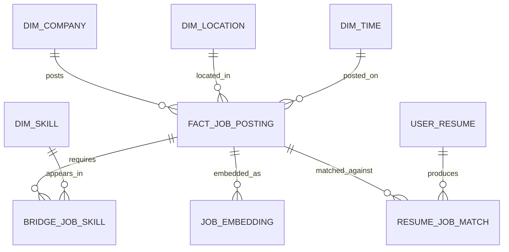

# Data Model

The data model should support both analytics and product workflows. It starts with raw source payloads, then builds cleaned canonical records, then adds analytics and AI-ready tables.

For the MVP, the model should grow in layers:

```text
Bronze  ->  Silver  ->  Gold
Raw     ->  Clean   ->  Analytics/Product
```

The early implementation should favor learning and reproducibility over a perfect final schema. Store raw data first, extract only fields we clearly understand, and promote fields into richer dimensions only after the source patterns are proven across multiple companies.

## Entity Relationship Diagram



## Bronze Layer

Raw source data used for reproducibility and debugging. This layer should preserve the full source response with minimal interpretation.

The purpose of Bronze is to make ingestion auditable:

- What source did this record come from?
- What did the source return at fetch time?
- Did the payload change across runs?
- Can we reprocess old payloads after improving parsing logic?

### raw_job_payloads

| Column | Type | Notes |
| --- | --- | --- |
| raw_payload_id | string | Unique raw record ID |
| source_name | string | Source system, such as Greenhouse or Lever |
| source_company | string | Source-specific company or board token, such as a Greenhouse board token |
| source_job_id | string | Job ID from the source |
| fetched_at | timestamp | Time the source was fetched |
| payload_json | json | Raw job object from the source |
| payload_hash | string | Used to detect changes |

## Silver Layer

Cleaned canonical records. This layer extracts stable, source-independent fields that product screens and downstream transformations can use.

For the first Greenhouse-based MVP, `canonical_jobs` should stay close to the source object. More normalized dimensions such as companies, locations, and time can come later after we see enough source variation.

### canonical_jobs

| Column | Type | Notes |
| --- | --- | --- |
| job_id | string | Internal job ID |
| source_name | string | Source system |
| source_company | string | Source-specific company or board token |
| source_job_id | string | Source job ID |
| source_internal_job_id | string | Optional source internal job ID when available |
| requisition_id | string | Company or source requisition identifier when available |
| company_name | string | Company name from the source or source config |
| title | string | Original job title |
| normalized_title | string | Standardized role name |
| location_name | string | Source-provided broad location, such as `Japan` |
| office_location | string | More specific office location when available, such as `Tokyo, Japan` |
| department_name | string | First extracted department name for the MVP |
| remote_type | string | remote, hybrid, onsite, unknown |
| seniority | string | intern, junior, mid, senior, staff, manager, unknown |
| job_url | string | Public job posting URL |
| source_published_at | timestamp | Source-provided publish timestamp, such as Greenhouse `first_published` |
| source_updated_at | timestamp | Source-provided update timestamp, such as Greenhouse `updated_at` |
| description_html | text | Source job description as HTML or HTML-escaped content |
| description_text | text | Cleaned plain-text job description |
| salary_min | numeric | Normalized annual salary when available |
| salary_max | numeric | Normalized annual salary when available |
| currency | string | Currency code |
| first_seen_at | timestamp | First ingestion time |
| last_seen_at | timestamp | Most recent ingestion time |
| is_active | boolean | Whether the posting still appears active |

### MVP Canonical Design Notes

The first canonical table intentionally keeps some fields denormalized:

- `company_name` stays directly on `canonical_jobs` before creating a company dimension.
- `location_name` and `office_location` stay directly on `canonical_jobs` before creating a location dimension.
- `department_name` stores the first department for v0, even though source departments can be arrays.
- `description_html` and `description_text` are both useful because the raw source content is HTML-like, while search and skill extraction need plain text.

This keeps the first implementation understandable while preserving a path toward more normalized tables later.

## Future Silver Dimensions

After the MVP proves the ingestion and exploration loop, these dimensions can be introduced to reduce duplication and support richer analysis.

### companies

| Column | Type | Notes |
| --- | --- | --- |
| company_id | string | Internal company ID |
| company_name | string | Canonical company name |
| company_domain | string | Optional domain |
| industry | string | Optional enrichment |
| size_bucket | string | Optional company size range |

### locations

| Column | Type | Notes |
| --- | --- | --- |
| location_id | string | Internal location ID |
| city | string | City |
| state | string | State or region |
| country | string | Country |
| metro_area | string | Optional metro grouping |
| latitude | numeric | Optional geocoding |
| longitude | numeric | Optional geocoding |

### skills

| Column | Type | Notes |
| --- | --- | --- |
| skill_id | string | Internal skill ID |
| skill_name | string | Canonical skill name |
| skill_category | string | language, framework, cloud, database, tool, method |

### job_skills

| Column | Type | Notes |
| --- | --- | --- |
| job_id | string | Foreign key to canonical job |
| skill_id | string | Foreign key to skill |
| confidence | numeric | Extraction confidence |
| extraction_method | string | rules, model, llm, manual |
| is_required | boolean | Required vs preferred when known |

## Gold Layer

Analytics-ready tables and aggregates.

For the MVP, Gold does not need to start as physical tables. Streamlit can run SQL queries against Silver tables first. If the same queries become important or expensive, promote them into views or materialized tables.

### fact_job_postings

One row per canonical job posting per observed status period.

Useful measures:

- Posting count
- Active posting count
- Salary min and max
- Days active
- Skill count

### mart_skill_trends

Aggregated skill demand over time.

Dimensions:

- Skill
- Role
- Location
- Seniority
- Time period

Measures:

- Posting count
- Share of postings mentioning the skill
- Period-over-period growth

### mart_company_hiring_velocity

Aggregated company hiring activity over time.

Measures:

- New postings
- Closed postings
- Active postings
- Growth rate
- Top roles
- Top skills

### Additional MVP Analytics Candidates

Useful early dashboard queries:

- Jobs by company
- Jobs by normalized role
- Top extracted skills
- Remote vs hybrid vs onsite mix
- Job counts by source publish date
- Job counts by department

## AI Tables

### job_embeddings

| Column | Type | Notes |
| --- | --- | --- |
| job_id | string | Foreign key to canonical job |
| embedding_model | string | Embedding model name |
| embedding_vector | vector | Vector representation |
| embedded_text_hash | string | Detects when re-embedding is needed |
| created_at | timestamp | Embedding creation time |

### user_resumes

| Column | Type | Notes |
| --- | --- | --- |
| resume_id | string | Internal resume ID |
| user_id | string | Optional user ID |
| resume_text | text | Parsed resume content |
| uploaded_at | timestamp | Upload time |

### resume_job_matches

| Column | Type | Notes |
| --- | --- | --- |
| match_id | string | Internal match ID |
| resume_id | string | Foreign key to resume |
| job_id | string | Foreign key to job |
| match_score | numeric | Overall match score |
| matched_skills | json | Skills found in both |
| missing_skills | json | Skills required by job but missing from resume |
| reasoning | text | Explanation shown to user |
| created_at | timestamp | Match time |
