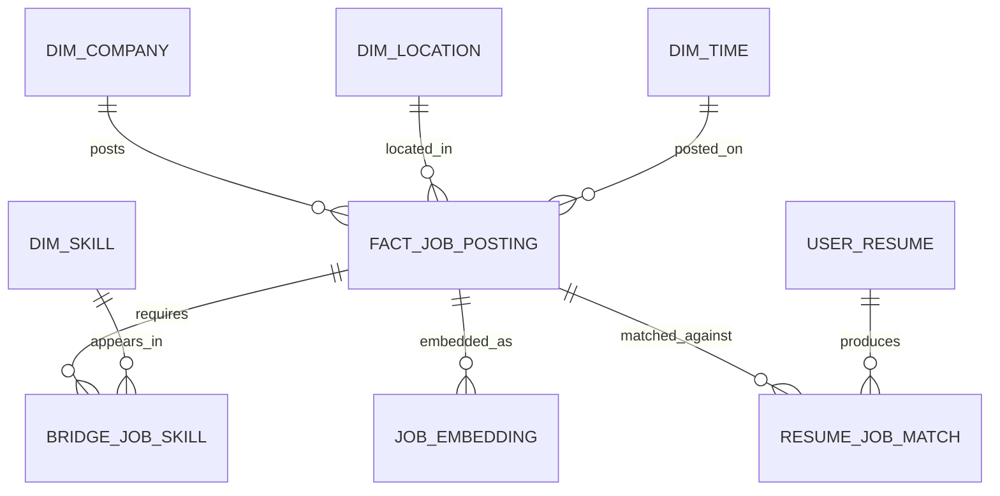

# Data Model

The data model should support both analytics and product workflows. It starts with canonical job postings, then builds dimensions, facts, aggregates, and AI-enriched records.

## Entity Relationship Diagram

## Bronze Layer

Raw source data used for reproducibility and debugging.

### raw_job_payloads

| Column | Type | Notes |
| --- | --- | --- |
| raw_payload_id | string | Unique raw record ID |
| source_name | string | Source system, such as Greenhouse or Lever |
| source_job_id | string | Job ID from the source |
| fetched_at | timestamp | Time the source was fetched |
| payload | json | Raw response body |
| payload_hash | string | Used to detect changes |

## Silver Layer

Cleaned canonical records.

### canonical_jobs

| Column | Type | Notes |
| --- | --- | --- |
| job_id | string | Internal job ID |
| source_name | string | Source system |
| source_job_id | string | Source job ID |
| company_id | string | Foreign key to company |
| title | string | Original job title |
| normalized_title | string | Standardized role name |
| description | text | Cleaned job description |
| location_id | string | Foreign key to location |
| remote_type | string | remote, hybrid, onsite, unknown |
| seniority | string | intern, junior, mid, senior, staff, manager, unknown |
| salary_min | numeric | Normalized annual salary when available |
| salary_max | numeric | Normalized annual salary when available |
| currency | string | Currency code |
| posted_at | timestamp | Source posting date |
| first_seen_at | timestamp | First ingestion time |
| last_seen_at | timestamp | Most recent ingestion time |
| is_active | boolean | Whether the posting still appears active |

### companies

| Column | Type | Notes |
| --- | --- | --- |
| company_id | string | Internal company ID |
| company_name | string | Canonical company name |
| company_domain | string | Optional domain |
| industry | string | Optional enrichment |
| size_bucket | string | Optional company size range |

### locations

| Column | Type | Notes |
| --- | --- | --- |
| location_id | string | Internal location ID |
| city | string | City |
| state | string | State or region |
| country | string | Country |
| metro_area | string | Optional metro grouping |
| latitude | numeric | Optional geocoding |
| longitude | numeric | Optional geocoding |

### skills

| Column | Type | Notes |
| --- | --- | --- |
| skill_id | string | Internal skill ID |
| skill_name | string | Canonical skill name |
| skill_category | string | language, framework, cloud, database, tool, method |

### job_skills

| Column | Type | Notes |
| --- | --- | --- |
| job_id | string | Foreign key to canonical job |
| skill_id | string | Foreign key to skill |
| confidence | numeric | Extraction confidence |
| extraction_method | string | rules, model, llm, manual |
| is_required | boolean | Required vs preferred when known |

## Gold Layer

Analytics-ready tables and aggregates.

### fact_job_postings

One row per canonical job posting per observed status period.

Useful measures:

- Posting count
- Active posting count
- Salary min and max
- Days active
- Skill count

### mart_skill_trends

Aggregated skill demand over time.

Dimensions:

- Skill
- Role
- Location
- Seniority
- Time period

Measures:

- Posting count
- Share of postings mentioning the skill
- Period-over-period growth

### mart_company_hiring_velocity

Aggregated company hiring activity over time.

Measures:

- New postings
- Closed postings
- Active postings
- Growth rate
- Top roles
- Top skills

## AI Tables

### job_embeddings

| Column | Type | Notes |
| --- | --- | --- |
| job_id | string | Foreign key to canonical job |
| embedding_model | string | Embedding model name |
| embedding_vector | vector | Vector representation |
| embedded_text_hash | string | Detects when re-embedding is needed |
| created_at | timestamp | Embedding creation time |

### user_resumes

| Column | Type | Notes |
| --- | --- | --- |
| resume_id | string | Internal resume ID |
| user_id | string | Optional user ID |
| resume_text | text | Parsed resume content |
| uploaded_at | timestamp | Upload time |

### resume_job_matches

| Column | Type | Notes |
| --- | --- | --- |
| match_id | string | Internal match ID |
| resume_id | string | Foreign key to resume |
| job_id | string | Foreign key to job |
| match_score | numeric | Overall match score |
| matched_skills | json | Skills found in both |
| missing_skills | json | Skills required by job but missing from resume |
| reasoning | text | Explanation shown to user |
| created_at | timestamp | Match time |
